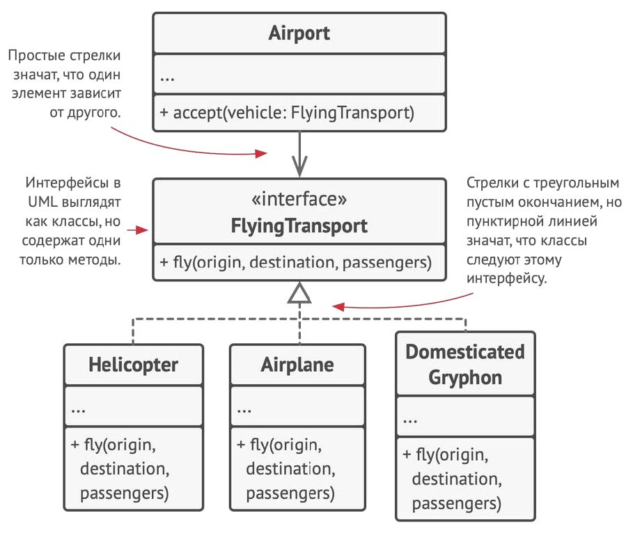
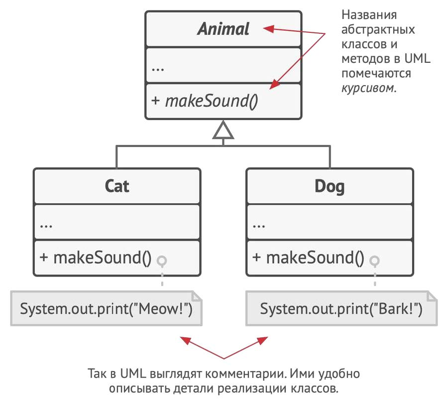

# Seminar 3
---

ООП - Объектно-ориентированное программирование

### Основы ООП:

- **Абстракция** (если студент: ФИО, номер группы логично, а вот кличка домашнего животного - абстракция);
- **Инкапсуляция** (неважно как реализован метод внутри, важно понимать, что этот метод
  делает `не вдаваясь в подробности`);
- **Наследование**;
- **Полиморфизм** (много методов с одинаковым названием, но параметры внутри разные)

### Важные моменты:

- функция не может быть записана вне класса
- переменные также нельзя создавать вне класса
- каждый класс наследник класса Object
- `public class` может быть только один в файле, причем название класса должно совпадать с названием файла
- `private` доступны внутри одного пакета `package`
- `extend` указывает на наследника текущего класса
- `static` принадлежат классу, а не экземпляру

На этом закончим с официальной частью и перейдем к более понятной :)

# Конспект про ООП от _блондинки_ или ООП на примере котиков

`Класс`: кот
`Поля` класса: состояние класса или одинаковый набор свойств, присущих данному классу (имя, пол, возраст, цвет и тд)

`Методы` класса: поведение класса (дышит(), ест(), мурчит(), спит() и тд)

`Объект` (экземпляр класса) - кот по кличке Пушистик, который обладет некими свойствами:

* имя: Пушистик
* пол: мужской
* возраст: 5 лет
* цвет: серый
* ...

Совокупность полей и методов называют `членами` класса.

Собаки и кошки обладют схожим набором свойств и поведением -> суперкласс `Животные`, где `Кот` и `Собака` являются
подклассами, которые наследуют свойства родительского класса, но также обладают своими уникальными свойствами (кошки
мяукают, собаки лаят)

> ### Синтаксис UML-диаграмм класса
>
> **+** public  
> **-** private

 

Подклассы могут переопределять методы, которые достались им от родителей. Причем они могут полностью как и изменить
поведение метода, так и только добавить что-то к результату родительского метода.

## Концепции ООП:

1. **Абстракция** - это модель некоего объекта или явления, в которой опущены незначительные детали, незначимые для
   конкретного случая

> Есть класс `Самолет`, который используется в программах `Авиасимулятор` и `Бронирование авиабилетов`. В авиасимуляторе будут важны детали пилотирования самолетом, а во втором - лишь расположение и занятость мест внутри

2. **Инкапсуляция** - публичная часть объекта, доступная остальным объектам

> При запуске автомобиля нам не нужно разбираться в том, что находится под капотом и как оно работает. У нас просто есть ключ-зажигания, руль и педали, остальное нас не интересует.

Поэтому инкапсуляция это свойство объекта скрывать часть своего поведения и состояния от других объектов за
ненадобностью

Можно инкапсулировать "скрыть" что-нибудь внутри класса, сделав это `private` (скрыть от других классов)
или `protected` (режим видимости для подклассов)

Можно менять как угодно код классов, и это никак не повлияет на совместимость `Аэропорта` с классами (
благодаря `интерфейсу`)

3. **Наследование** - создание новых классов на основе существующих

> Минус наследования: нельзя в подклассе исключить никакой метод из родительского класса

 На заметку:

- Класс может иметь только одного родителя
- Класс может реализовать несколько интерфейсов

4. **Полиморфизм** - способность вызывать необходимый метод при наличии одинаково названных функций

> ### Пример про абстрактный класс:
>
> - Есть абстрактный класс `Животное`, в котором есть метод (функция) `Издавать звук`
> - Такая же функция есть и у классов-наследников: `Кот` и `Собака`
> - Однако: у `Котов` определен вывод "Мяу", а у `Собак` - "Гав"
> - Вытянув случайное животное, программа самостоятельно определит, какую именно функцию стоит вывести и сама определит `Класс` объекта

